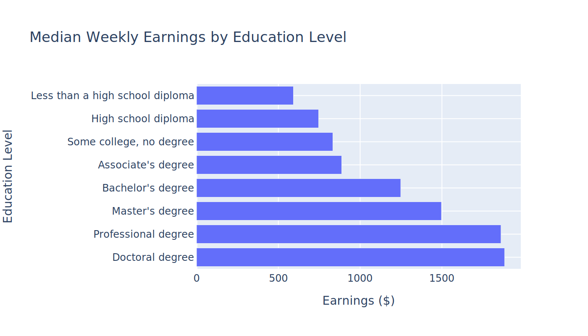
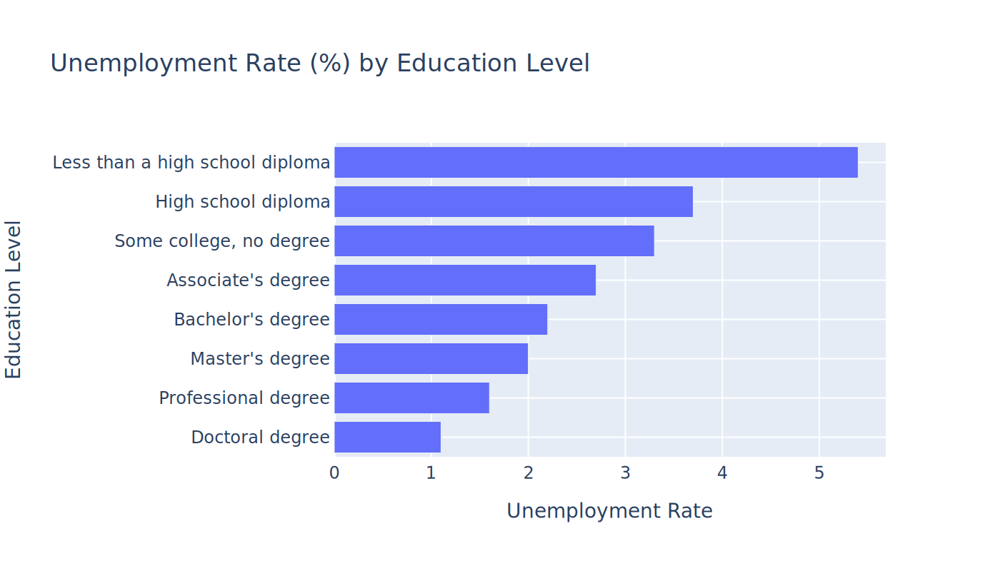
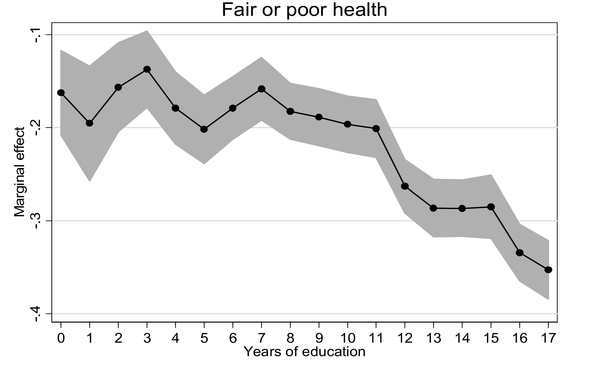
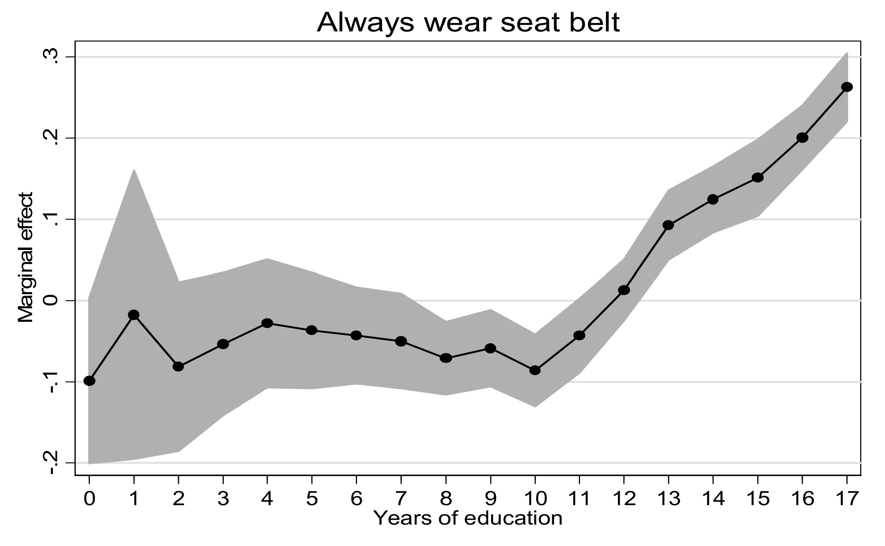

# Econ 4350/8316 - Business Intelligence and Reporting
## Welcome to Class!

---

# Who Am I?

Dusty White, PhD (he/him/his)

- From the Econ Department
- I LOVE data, and using it to tell stories

---

# Some Current Work

- Using Machine Learning to determine who committed unclaimed terrorist attacks
- Studying the effect of teacher strikes on high-school graduation
- Measuring how NFL expansion franchises affect profits of other franchises

---

# What is the class about?

- Using data to tell stories
- Communicating data to stakeholders

---

# What do I expect from you?
- Ask Questions!
- Experiment!
- Be willing to feel awkward (it's going to happen to all of us!)

---

# What should you expect from me?
- Prompt responses
- I will focus on the topics you express interest in
- I will be available on Aula as much as possible during the week to answer questions

---

# If you struggle

Reach out to me! The sooner you tell me, the sooner we can find a solution!
- I can (and will!) help you find support, even if the problem isn't about class!

---

# Canvas, Syllabus, Assignments, and Grades

Let's go take a look...

---

# Introduction to Reporting

---

# Reporting

- Reporting sounds boring, right?
- How often do you write reports just before they are due?

---

# So why do we even create reports?

---

# Reframe Reporting

- Reporting is our chance to tell stories with data
- As we practice we will be able to sell our vision of the data to stakeholders

---

# Reframe Reporting

- Do you like stories?
- What is your favorite story?

---

# Take 5 minutes to think about favorite story, and then we will take a turn telling them

You'll have ~3 minutes

---

# The Benefits of College Education - A Short Story

---

---

---

---

---

# What Kinds of Reporting?

- Dashboards
- Presentations
- Written Reports

---

# Today, Dashboards
#### Tomorrow, the World (also, more dashboards)