# Make that Dashboard Interactive!

---

# Dynamism in Dashboards

In order to make a presentation with a dashboard, we need to tie everything in our dashboard together.

---

# Dynamism in Dashboards

---

# How do we get there?

- Instruct our filters to apply to all visuals built on the same data
- Use **Actions** to make our visuals themselves function as filters

---

# Learn by doing!

Let's dive in!