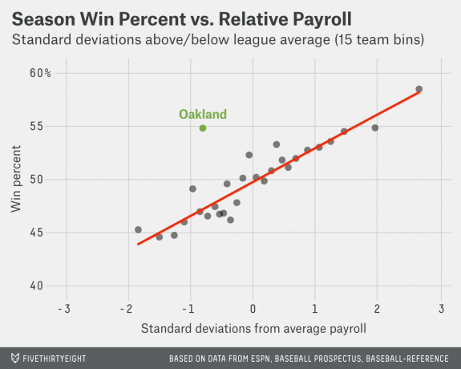
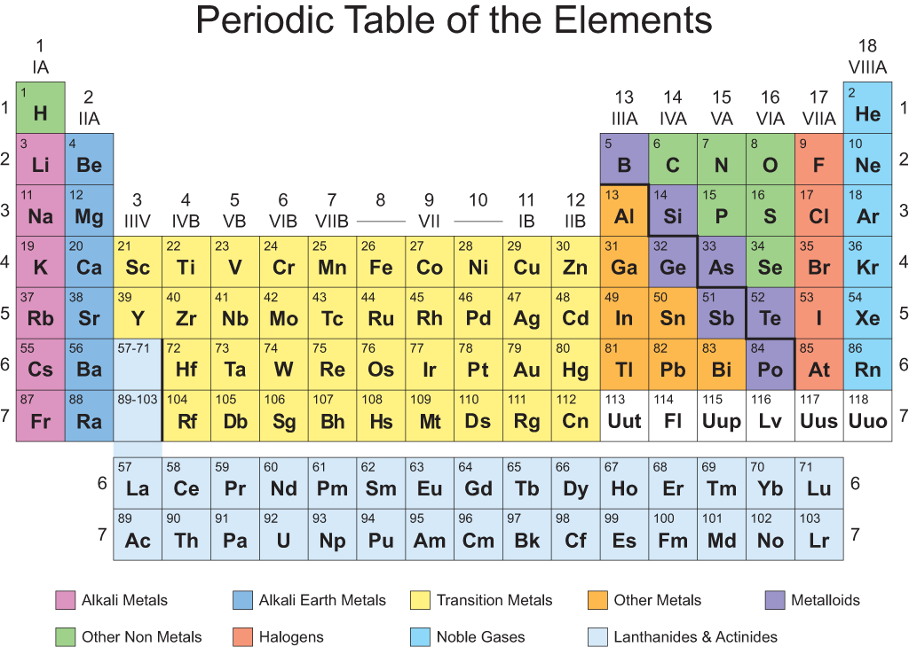
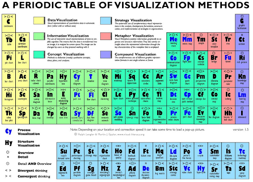
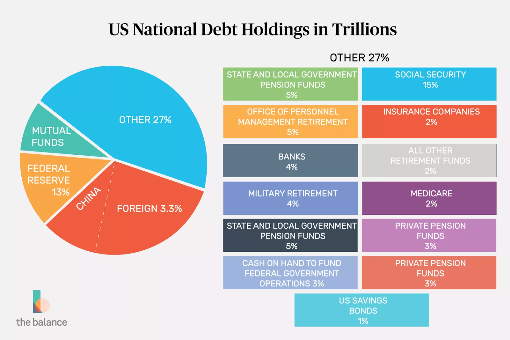

# Choosing the Right Visual

---

---

# The Art of Visualizing Data
- Storytelling is an art
- Visualization is a form of storytelling

---

> Why should we be interested in visualization? Because the human visual system is a pattern seeker of enormous power and subtlety. The eye and the visual cortex of the brain form a massively parallel processor that provides the highest-bandwidth channel into human cognitive centers.... If we can understand how perception works, our knowledge can be translated into rules for displaying information.... [W]e can present our data in such a way that the important and informative patterns stand out. If we disobey the rules, our data will be incomprehensible or misleading.

-- Colin Ware (*Information Visualization: Perception for Design*)

---

# Data is the art of storytelling
### Let's really make it ART

When we present data, we are trying to tell a story. 
- Kids prefer stories with illustrations, because they are only just learning about how the world looks and works
- Visualization aids unfamiliar audiences

Find a clear story to tell, and let your visuals help you tell it.

---

# The challenges of visualization

1. Dimensionality
    - We often have a lot of different features in our data
    - We can’t easily process more than 2 or 3 at once
2. Context
    - It can be hard to understand a figure’s context

---

# Classic Visuals

---

# Classic Visuals

Our visuals should be
1. Aesthetically Pleasing
2. Novel
3. Informative
4. Efficient

---

# Aesthetically Pleasing

- Don’t let beauty overwhelm data
- Aesthetics should accentuate the information
- Familiar looks and feels can help!

---

# Novel

A visual can be novel in many ways:

- Novel Data
- Novel Insights
- Novel Presentation

 

> Most often, designs that delight us do so not because they were designed to be novel, but because they were designed to be effective -- Beautiful Visualization

---

# Informative

> A visual that [is not informative] has failed. -- Beautiful Visualization

**Ask**: What is the intended usage of our visual?

> My goal is to display ______ so that ______ can _______.

- What is our context of use?
- Is it for presentation or exploration?

Catering a visual to our audience ensures that they can quickly obtain the most valuable information.

---

# Informative

---

# Informative

An example I made: [Dash4Hank](http://dash4hank.herokuapp.com/)

Why do firms struggle to hire CS talent in Omaha/Nebraska?

---

# Efficient

> Irrelevant data is the same thing as noise. If it’s not helping, it’s probably getting in the way. -- Beautiful Visualization

- The minimum viable product concept is critical in visualization of data
    - Each new element slows your audience's perception of the important points
    - BUT! Don't omit critical components

---

# Efficient

---

# An amazing visual

---

# A Bad Copycat

---

# So terrible...

---

# It's so bad!

Maybe we do [this](https://github.com/d3/d3/wiki/Gallery) instead...

Or [this](https://python-graph-gallery.com/)?

Or anything else!

---

# Another atrocity

---

# A template process

1. Write down your goal and intent for the visual
2. Gather the data that will help you achieve that goal
3. Decide how to tell your intended story with the data
4. Apply a visual representation of your data

---

# Visual Options in Power BI

Let's walk through this process to address the following question:

> How have global civil liberties changed over time?

---

# Visual Options in Power BI

We will explore the following charts:
1. Bar Chart
2. Histogram
4. Line Charts (revisited)

And the following techniques:
- Grouping
- Aggregating
- Trend Lines

(We are saving maps for their own lesson!)

---

# Lab Time!

Choose a way to visualize [Omaha Weather Data](https://github.com/dustywhite7/Econ4350/raw/master/Data/civilLibertiesIndex.csv) in order to tell a story. The story you choose to tell is up to you! Please submit the following:

1. Your Power BI workbook
2. A word document with a brief explanation of what story you want to tell, as well as why you think the visual you created is the correct way to present that story